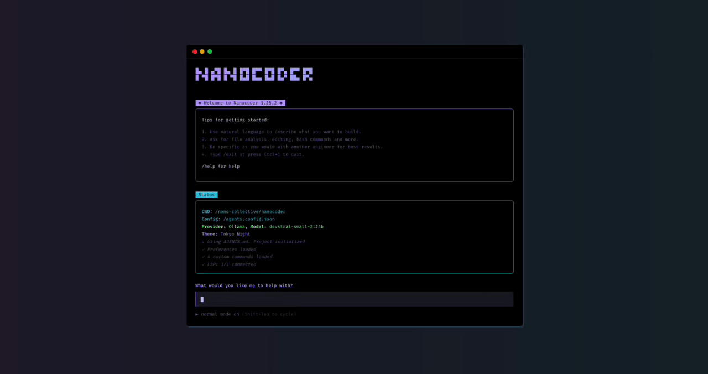

# Nanocoder

A local-first CLI coding agent that brings the power of agentic coding tools like Claude Code and Gemini CLI to local models or controlled APIs like OpenRouter. Built with privacy and control in mind, Nanocoder supports multiple AI providers with tool support for file operations and command execution.



---


## Quick Start

```bash
npm install -g @nanocollective/nanocoder
nanocoder
```

Also available via [Homebrew](docs/getting-started/installation.md#homebrew-macoslinux) and [Nix Flakes](docs/getting-started/installation.md#nix-flakes).

## Documentation

Full documentation is available in the [docs/](docs/) folder:

- **[Getting Started](docs/getting-started/index.md)** - Installation, setup, and first steps
- **[Usage](docs/usage/index.md)** - Interactive mode, non-interactive mode, CLI options, keyboard shortcuts
- **[Configuration](docs/configuration/index.md)** - AI providers, MCP servers, preferences, logging, timeouts
- **[Features](docs/features/index.md)** - Custom commands, checkpointing, task management, scheduler, sessions
- **[Commands Reference](docs/commands.md)** - Complete list of built-in slash commands
- **[Community](docs/community.md)** - Contributing, Discord, and how to help

## Community

We're a community-led project building local-first AI coding tools. We'd love your help!

- **Contributing**: See [CONTRIBUTING.md](CONTRIBUTING.md) for development setup and guidelines
- **Discord**: [Join our server](https://discord.gg/ktPDV6rekE) to connect with other users and contributors
- **GitHub**: Open issues or join discussions on our repository
